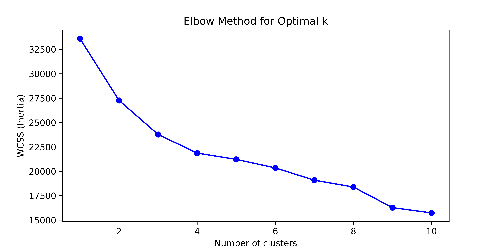
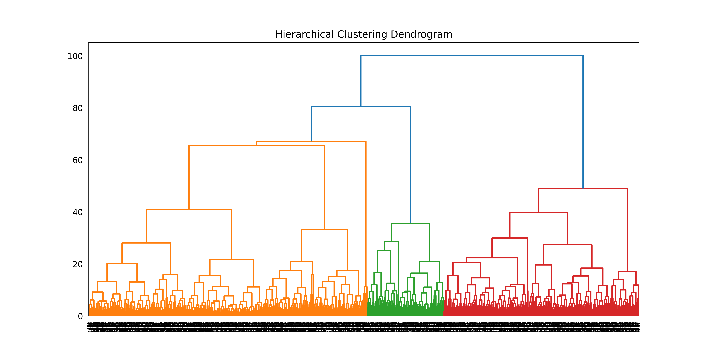
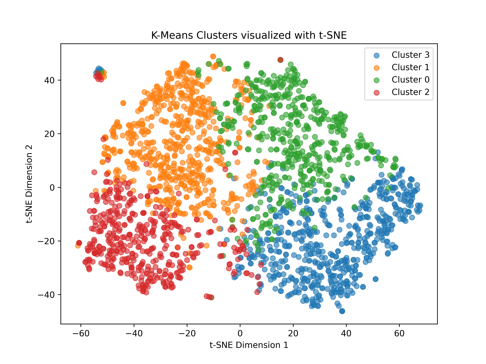
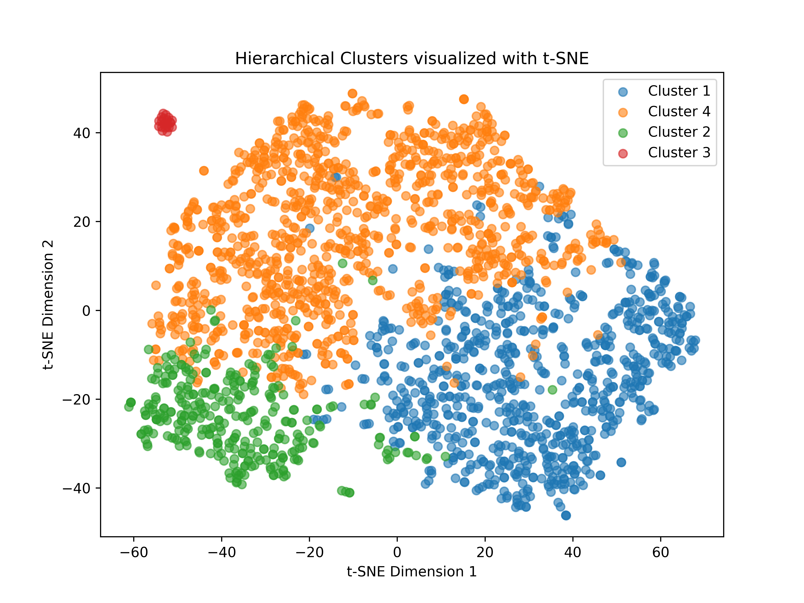

# 🛍️ Customer Behavior Segmentation with Clustering

This project applies **unsupervised machine learning** techniques to segment customers based on their purchase behavior, campaign responses, and engagement patterns.  
The dataset is taken from Kaggle: [Customer Segmentation Data](https://www.kaggle.com/datasets/vishakhdapat/customer-segmentation-clustering/data).

---

## 📌 Project Overview
- **Goal:** Identify distinct customer groups for targeted marketing strategies.  
- **Approach:**  
  - Data preprocessing and feature engineering  
  - Feature scaling  
  - K-Means clustering with optimal k selection  
  - Hierarchical clustering with dendrograms and silhouette analysis  
  - Visualization using t-SNE for dimensionality reduction  
  - Cluster profiling with interactive visualizations  

---

## 📂 Workflow

### 1. Data Loading
- Imported dataset (`marketing_campaign.csv`) from Kaggle.  
- Handled `Year_Birth` to calculate **Age**.  
- Focused on purchase amounts, campaign acceptance, and shopping channel activity.  

### 2. Feature Engineering
- Computed **Total Spend** across product categories.  
- Derived **spend ratios** (e.g., Wine_Ratio, Meat_Ratio).  
- Calculated **Campaign Acceptance Rate**.  
- Selected final features for clustering.

### 3. Feature Scaling
- Standardized features using **StandardScaler**.  

### 4. K-Means Clustering
- Applied **K-Means (k=4)**.  
- Used the **Elbow Method** to evaluate optimal number of clusters.  

### 5. Hierarchical Clustering
- Applied **Ward’s method** linkage.  
- Visualized with a **dendrogram**.  
- Calculated silhouette scores to evaluate cluster quality.  

### 6. Dimensionality Reduction & Visualization
- Applied **t-SNE** for 2D visualization of clusters.  
- Plotted both **K-Means** and **Hierarchical** clusters.  

  

### 7. Cluster Profiling
- Generated **summary statistics** per cluster.  
- Built interactive bar charts with Plotly for comparison.  

---

## 🔎 Insights from Clustering

### **K-Means Clusters**
- **Cluster 0 – “Moderate Spenders”**  
  - Avg spend: ~786, wine-focused (67%)
  - High activity: web (6.7) and store (7.6) purchases
  - Low complaint rate, moderate campaign acceptance
  - High discount shopping rate
  - Loyal segment  

- **Cluster 1 – “Low Spenders”**  
  - Avg spend: ~113
  - Moderate wine proportion, higher meat spending
  - Lower number of purchases overall, still active online (6.2 web visits)
  - Lower campaign response
  - Price-sensitive

- **Cluster 2 – “Occasional Shoppers”**  
  - Avg spend: ~123
  - Higher proportion on fruits, sweets, gold
  - Low number of purchases in stores and online, still active online (6.4 web visits)
  - High complaint rate (~1.6%)
  - Low campaign acceptance
  - Niche buyers or gift shoppers  

- **Cluster 3 – “Big Spenders”**  
  - Avg spend: ~1314
  - High proportion on wine and meat
  - Lower web activity
  - High catalog/store activity
  - Best campaign responders
  - Very valuable for targeted campaigns, may respond well to personalized offers.

👉 **Key Takeaway:**  
K-Means produced **actionable clusters** differentiated by **spend level, product preference, and channel activity** → valuable for targeted marketing strategies.

---

### **Hierarchical Clustering Observation**
- One cluster was entirely defined by the **Complain** variable.  
- Overfitted rare behavior (1% of customers).  
- Less useful for actionable marketing compared to K-Means.  

---

## ⚙️ Technologies Used
- **Python**, **Pandas**, **NumPy**  
- **Scikit-learn**, **SciPy**  
- **Matplotlib**, **Seaborn**, **Plotly**  
- **t-SNE** for dimensionality reduction  
